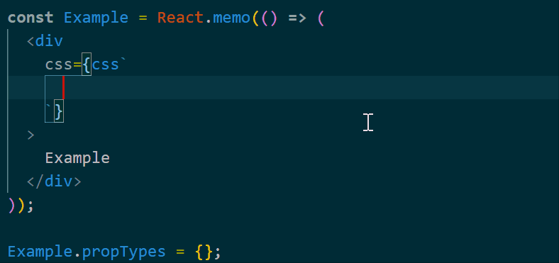

# emotion-auto-css README

if you want it to work in jsx、tsx and ts. You need add this setting in vscode:

```
"editor.quickSuggestions": {
    "strings": true
}
```

You can get the style name prompt in normal format in this code.

```
<div css={css``}></div>
```

## Features



## Release Notes

### 0.0.4

make it smarter

- Add properties hints for some styles
- Remove the style name prompt in properties area

### 0.0.3

fix not prompted in jsx、tsx、ts. But you need add setting this in vscode.

```
"editor.quickSuggestions": {
    "strings": true
}
```

### 0.0.2

update README.md

### 0.0.1

a simple version

---
